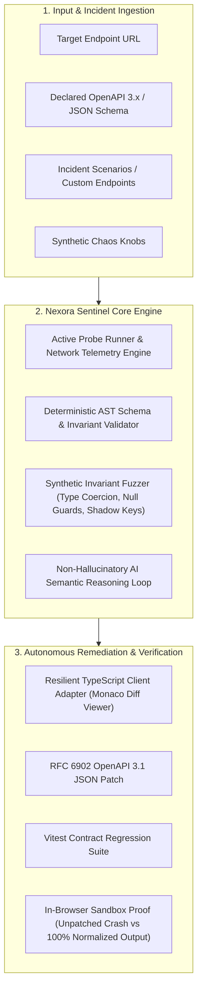

# Nexora Sentinel
### Autonomous API Incident Triage & Contract Drift Intelligence Platform
**Track:** Coding Track — Computer Science + AI (Technology)  
**Hackathon:** EurekaDEV 2026 — Innovation Without Limits  
**Submission Status:** Production-Ready Functional Prototype  

---

## 1. Problem Statement

Modern cloud and microservice architectures integrate dozens of internal services and third-party APIs (Stripe, Okta, Twilio, ERPs). When upstream services deploy updates without incrementing major version numbers, breaking changes occur silently in production:

1. **Semantic Representation Shifts:** Upstream billing engines upgrade to ISO 4217 minor units (changing `$49.99` decimal dollars into `4999` integer cents) while retaining HTTP `200 OK`. Downstream client applications either crash or overcharge end customers by 100x.
2. **Silent 200 OK Gateway Fallbacks:** Upstream API gateways catch circuit-breaker timeouts and serialize error envelopes (`{"success": false, "error": {...}}`) with status `200 OK`. Frontend apps treat this as an empty dataset ("0 items found"), masking catastrophic outages from traditional uptime monitors.
3. **Breaking Claim Relocations:** Identity providers deprecate top-level properties (e.g., dropping `email_verified` in favor of nested `identity_meta.is_verified`), causing uncaught `TypeError: Cannot read properties of undefined` in client applications.

Traditional OpenAPI linters (spectral, swagger-cli) only inspect static design documents during CI. They **cannot detect runtime semantic payload drift, status code anti-patterns, or dynamic network jitter**.

---

## 2. Solution: Nexora Sentinel

Nexora Sentinel is an autonomous developer platform that actively probes API endpoints, executes synthetic invariant fuzzing, isolates root causes through AI-driven semantic reasoning, and generates verified TypeScript client patches with in-browser proof.



---

## 3. Technical Innovation

* **Dual-Engine Validation (Deterministic + Semantic AI):** Strict AST schema validation flags structural breaks, while the semantic reasoning engine detects numerical scale mutations (e.g. cents vs. dollars) that pass conventional schema validators because `4999` is technically a valid `number`.
* **Synthetic Invariant Fuzzing:** Actively mutates payload boundaries (null injection, string-number coercion, shadow fields, latency injection) to expose fragile endpoints before outages hit end-users.
* **Autonomous Remediation Synthesis:** Automatically writes production-ready TypeScript client adapters handling both legacy and mutated schemas, OpenAPI 3.1 migration patches, and Vitest regression suites.
* **In-Browser Sandbox Fix Verification:** Demonstrates empirical proof of fix within 2 milliseconds by executing the drifted payload against legacy code (showing the uncaught exception) and then against the generated adapter (confirming 100% invariant recovery).

---

## 4. Key Features

| Capability | Description |
| :--- | :--- |
| **Active Probe Dispatcher** | Dispatches HTTP probes measuring TTFB, latency percentiles, and runtime status codes. |
| **Pre-loaded Incident Presets** | Includes 4 authentic enterprise scenarios: Fintech Payment Cents Drift, Identity Provider Breaking Claim Deletion, Microservice Silent 200 Gateway Outage, and Logistics Geo-Coordinate String Mutation. |
| **Custom Live Endpoint Mode** | Test any public or internal API endpoint with custom schemas and headers. |
| **Resilience Scoring (0–100)** | Objective health metric penalizing critical, high, and medium contract anomalies. |
| **Interactive Drift Anomaly Cards** | Visualizes JSONPath, expected contract rules, actual received values, and quantified impact. |
| **AI Root-Cause Isolation** | Provides executive summaries, affected architectural components, and technical depth explanations with confidence scores. |
| **Monaco Code Workspace** | Embedded syntax-highlighted code editor for TypeScript adapters, JSON Patches, and Vitest test suites. |
| **1-Click Sandbox Proof** | Runs automated assertions in an isolated execution sandbox proving 100% bug resolution. |

---

## 5. Technology Stack

* **Frontend:** React 19, TypeScript 6, Vite 8, Tailwind CSS v4, Lucide Icons.
* **Code Editor:** `@monaco-editor/react` (VS Code engine in browser).
* **Core Engine:**
  * `src/lib/engine/schema-validator.ts`: Deterministic AST schema and invariant analyzer.
  * `src/lib/engine/probe-runner.ts`: Probe dispatcher with synthetic chaos injection.
  * `src/lib/engine/sandbox-executor.ts`: Client runtime sandbox verification engine.
  * `src/lib/engine/remediation-generator.ts`: Automated adapter and test suite synthesizer.
* **AI Architecture:**
  * `src/lib/ai/diagnostic-service.ts`: Structured prompt reasoning pipeline with deterministic fallback engine (zero API keys needed for evaluation).
* **Testing & QA:** Vitest, Playwright browser automation, Oxlint (0 warnings, 0 errors).

---

## 6. Getting Started

### Prerequisites
* Node.js `>= 18.0.0` (tested on Node.js v24)
* npm `>= 9.0.0`

### Installation
```bash
# Clone the repository
git clone https://github.com/mareknardella-lgtm/Nexora.git
cd Nexora

# Install dependencies
npm install
```

### Environment Configuration
Nexora Sentinel works **100% out of the box** with zero configuration thanks to its built-in deterministic AI engine. If you wish to connect an external LLM API key, create a `.env` file:
```bash
cp .env.example .env
```

---

## 7. Running Locally

```bash
# Start Vite development server
npm run dev
```
Open [http://localhost:5173](http://localhost:5173) in your browser.

---

## 8. Running Tests & Quality Gates

```bash
# Run Vitest unit & integration test suite
npm run test

# Run Oxlint static analysis (0 warnings, 0 errors)
npm run lint

# Run production build
npm run build
```

---

## 9. AI Usage Transparency

In accordance with EurekaDEV 2026 guidelines, AI transparency is maintained throughout:
* **Product Role:** AI is used strictly for **semantic root-cause correlation and adapter code synthesis**. It evaluates anomalies flagged by the deterministic AST validator and outputs structured, non-hallucinatory diagnostics.
* **Development Role:** AI assistance was used for rapid component scaffolding, test case generation, and documentation drafting. All code adheres to strict TypeScript checking, deterministic unit test verification, and automated linting.

---

## 10. License

MIT License. Developed for **EurekaDEV 2026 — Innovation Without Limits**.
